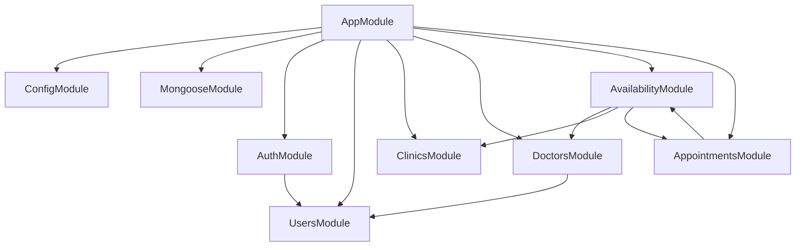
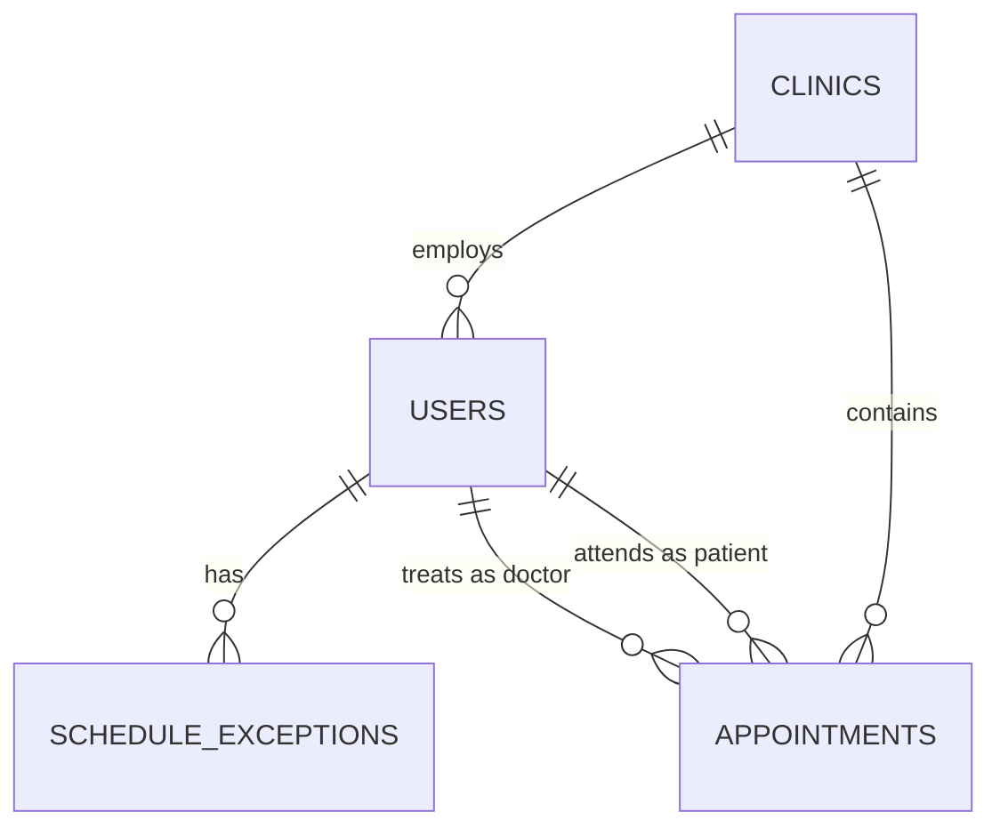
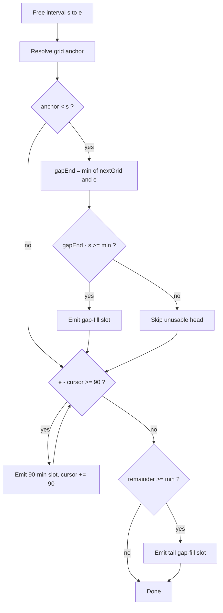

# Architecture

This is the shared reference for every phase. It defines the module boundaries, the complete data model, and the scheduling engine specification. When a phase document says "see architecture.md", it means this file.

## Module map



`AvailabilityModule` and `AppointmentsModule` reference each other: availability needs booked appointments to compute free time, and appointment creation needs availability to re-validate a slot before committing. Break the cycle by having `AppointmentsModule` export a thin read-only `AppointmentsQueryService` that `AvailabilityModule` imports, while `AppointmentsModule` imports the full `AvailabilityModule` with `forwardRef`.

## Responsibilities

| Module | Owns |
|---|---|
| `common` | Guards, decorators, exception filter, shared enums and interfaces |
| `config` | Env loading and schema validation |
| `auth` | Registration, login, JWT issuing, passport strategy |
| `users` | The `users` collection and its repository-style service |
| `clinics` | The single clinic document and its duration settings |
| `doctors` | Doctor listing, weekly working hours, schedule exceptions |
| `availability` | The pure slot calculator and the availability endpoint |
| `appointments` | Booking creation, cancellation, and queries |

## Data model

Four collections. All timestamps are stored in UTC.

### `users`

One collection for everyone. The `role` field discriminates.

| Field | Type | Notes |
|---|---|---|
| `_id` | ObjectId | |
| `name` | string | Required |
| `email` | string | Required, unique, lowercased |
| `phone` | string | Required for patients, optional for staff |
| `passwordHash` | string | bcrypt, never serialized |
| `role` | `'patient' \| 'doctor' \| 'nurse'` | Required |
| `clinicId` | ObjectId \| null | Set for staff, `null` for patients |
| `active` | boolean | Default `true`; inactive doctors are not bookable |
| `workingHours` | `WorkingHoursEntry[]` | Only meaningful when `role === 'doctor'` |
| `createdAt` / `updatedAt` | Date | Mongoose timestamps |

`WorkingHoursEntry` is an embedded subdocument:

| Field | Type | Notes |
|---|---|---|
| `weekday` | number | `0` = Sunday through `6` = Saturday |
| `startMinute` | number | Minutes from local midnight, e.g. `540` = 09:00 |
| `endMinute` | number | e.g. `1080` = 18:00; must be greater than `startMinute` |
| `isDayOff` | boolean | When `true`, the day has no working window |

Storing minutes-from-midnight rather than a `"09:00"` string keeps all schedule arithmetic integer-based. Only the final conversion to an absolute UTC instant needs timezone awareness.

Indexes: unique on `email`; compound on `{ role: 1, active: 1 }` for the doctor listing.

### `clinics`

Exactly one document exists in the MVP. It holds the tunable scheduling constants so they are not scattered through the code.

| Field | Type | Default | Notes |
|---|---|---|---|
| `_id` | ObjectId | | |
| `name` | string | | |
| `timezone` | string | `'Asia/Yerevan'` | IANA name; everything client-facing is rendered in this zone |
| `consultationDurationMinutes` | number | `15` | |
| `treatmentDurationMinutes` | number | `90` | The standard treatment length |
| `minTreatmentDurationMinutes` | number | `60` | A treatment slot shorter than this is never offered |
| `bufferMinutes` | number | `0` | Gap enforced around every appointment |

`bufferMinutes` is `0` for the MVP, but it must exist as a real setting that the algorithm reads. Hardcoding zero into the slot math makes adding buffers later a rewrite instead of a config change.

### `schedule_exceptions`

Per-date overrides of a doctor's weekly hours: holidays, half days, one-off extended hours.

| Field | Type | Notes |
|---|---|---|
| `_id` | ObjectId | |
| `doctorId` | ObjectId | Ref `users` |
| `date` | string | `YYYY-MM-DD` in clinic-local time, not a `Date` |
| `isDayOff` | boolean | When `true`, the doctor does not work that date at all |
| `startMinute` | number \| null | Overrides the weekly start when `isDayOff` is `false` |
| `endMinute` | number \| null | Overrides the weekly end when `isDayOff` is `false` |
| `reason` | string \| null | Free text, shown to staff |

Storing `date` as a plain `YYYY-MM-DD` string avoids an entire class of "the holiday shifted by a day" timezone bugs. A calendar date is a label, not an instant.

Indexes: unique compound on `{ doctorId: 1, date: 1 }`.

### `appointments`

| Field | Type | Notes |
|---|---|---|
| `_id` | ObjectId | |
| `clinicId` | ObjectId | Ref `clinics` |
| `doctorId` | ObjectId | Ref `users` |
| `patientId` | ObjectId | Ref `users` |
| `type` | `'consultation' \| 'treatment'` | |
| `startTime` | Date | UTC |
| `endTime` | Date | UTC |
| `durationMinutes` | number | Denormalized; for treatments this is **not** always 90 |
| `status` | `'booked' \| 'cancelled' \| 'completed' \| 'no_show'` | Only `booked` occupies time |
| `createdBy` | `'patient' \| 'staff'` | |
| `createdById` | ObjectId | Who actually performed the action |
| `notes` | string \| null | The only clinical field in the MVP |

Indexes:

- `{ doctorId: 1, startTime: 1 }`, unique, with `partialFilterExpression: { status: 'booked' }` — the database-level double-booking guard, described in [phase 5](./phases/phase-5-appointments.md).
- `{ doctorId: 1, startTime: 1, status: 1 }` for the day-queue and availability queries.
- `{ patientId: 1, startTime: -1 }` for `GET /appointments/mine`.

`durationMinutes` is stored rather than derived because it is what clients display, and a gap-fill treatment legitimately lasts 75 minutes. Any client that assumes treatment means 90 minutes is broken.

### Entity relationships



## Scheduling engine specification

This is the single source of truth for slot generation. It lives entirely in the backend. Neither the web nor the mobile client computes slots — they render exactly what the API returns.

### Terminology

- **Working window** — the doctor's bookable range for one date, after applying weekly hours and any schedule exception. At most one contiguous window per day in the MVP.
- **Busy interval** — a `booked` appointment, expanded by `bufferMinutes` on each side.
- **Free interval** — working window minus the merged busy intervals.
- **Slot** — an offer of `{ start, end, durationMinutes, type }`.

### Consultation slots

Straightforward. For each free interval `[s, e)`, walk a cursor from `s` in `consultationDurationMinutes` steps and emit a slot whenever `cursor + 15 <= e`.

### Treatment slots

This is the part that needs care, and the part the whole product depends on.

A treatment is normally 90 minutes. But when a short consultation gets carved out of the middle of an otherwise-open 90-minute block, the leftover is shorter than 90. Rather than refusing to fill it, the system offers a **single treatment sized to exactly that leftover**, so the appointment ends back on the boundary it would have ended on anyway. That is the "no worries, next treatment can be 1h15" case from the spec.

For this to work, treatment slots need a **grid anchor**: a reference point from which the 90-minute boundaries are measured.

> **Grid anchor rule.** For a free interval starting at `s`, the anchor is the end time of the latest `booked` treatment on that day that ends at or before `s`. If there is no such treatment, the anchor is `s` itself.

Grid points are then `anchor`, `anchor + 90`, `anchor + 180`, and so on.

The algorithm for one free interval `[s, e)`:

1. Determine `anchor` by the rule above and set `cursor = s`.
2. **Head gap.** If `anchor < s`, the interval begins partway through a grid cell. Let `nextGrid` be the first grid point strictly greater than `s`, and let `gapEnd = min(nextGrid, e)`.
   - If `gapEnd - s >= minTreatmentDurationMinutes`, emit a slot `[s, gapEnd)` with that exact duration.
   - Set `cursor = gapEnd`. The head is now consumed either way — if it was too short to offer, it is simply skipped.
3. **Full slots.** While `e - cursor >= 90`, emit `[cursor, cursor + 90)` and advance `cursor` by 90.
4. **Tail gap.** Let `rem = e - cursor`. If `rem >= minTreatmentDurationMinutes`, emit `[cursor, e)` with duration `rem`.

A free interval shorter than `minTreatmentDurationMinutes` yields no treatment slots at all — only consultations can go there.



### Worked example

Verify any implementation against this trace by hand before trusting it. Clinic settings are the defaults: consultation 15, treatment 90, minimum treatment 60, buffer 0. The doctor works 09:00–18:00.

**Stage 1.** A consultation is booked 09:00–09:15.

Free intervals: `[09:15, 18:00)`. No treatment is booked yet, so the anchor is the interval start, 09:15. There is no head gap. Packing 90-minute slots gives 09:15, 10:45, 12:15, 13:45, 15:15. The cursor lands on 16:45 with 75 minutes left, which is at or above the 60-minute minimum, so a 75-minute tail slot is offered at 16:45.

Treatment slots offered: **09:15 (90), 10:45 (90), 12:15 (90), 13:45 (90), 15:15 (90), 16:45 (75)**.

**Stage 2.** The patient books the 09:15 treatment, so 09:15–10:45 is now taken. The next treatment offered starts at 10:45, then 12:15, and so on — unchanged from stage 1 minus the consumed slot.

**Stage 3.** Someone books a consultation at 10:45–11:00, inside what was an open 90-minute block running 10:45–12:15.

Bookings are now 09:00–09:15 consultation, 09:15–10:45 treatment, 10:45–11:00 consultation. The free interval is `[11:00, 18:00)`.

The latest booked treatment ends at 10:45, which is at or before 11:00, so the anchor is **10:45** — not the interval start. Grid points are 10:45, 12:15, 13:45, 15:15, 16:45, 18:15. The first grid point after 11:00 is 12:15, giving a head gap of 11:00–12:15 = **75 minutes**, which clears the 60-minute minimum and is offered. The cursor moves to 12:15 and normal 90-minute packing resumes: 12:15, 13:45, 15:15. The tail from 16:45 to 18:00 is another 75-minute slot.

Treatment slots offered: **11:00 (75), 12:15 (90), 13:45 (90), 15:15 (90), 16:45 (75)**.

The 75-minute slot at 11:00 fills the gap exactly and the day stays aligned to its original boundaries. This is precisely the behaviour Section 1 of the MVP spec describes.

### Purity requirement

The calculator must be a pure function. It receives everything it needs and touches nothing else:

```ts
type SlotInput = {
  window: { start: Date; end: Date } | null;   // null when the doctor does not work that day
  busy: Array<{ start: Date; end: Date; type: AppointmentType }>;
  settings: ClinicSchedulingSettings;
  type: AppointmentType;
};

function computeSlots(input: SlotInput): Slot[];
```

No injected repositories, no `new Date()` inside it, no database access. Loading the window and the bookings is the caller's job. Keeping this boundary is what makes the riskiest logic in the product something you can reason about by reading one file.

## Cross-cutting conventions

**Routing.** Global prefix `/api/v1`, set with `app.setGlobalPrefix('api/v1')`. Swagger UI is served at `/api/docs` and excluded from the prefix.

**Time.** Everything is stored and returned in UTC ISO-8601 with a `Z` suffix. The clinic's IANA `timezone` is exposed via `GET /clinic` so clients can render local time. Working hours are minutes-from-local-midnight and are resolved to absolute UTC instants per requested date using `luxon`, which handles DST transitions correctly. Never build a local time by adding a fixed offset.

**Dates in query parameters.** Calendar dates are `YYYY-MM-DD` strings interpreted in clinic-local time, never `Date` objects parsed from a client's own timezone.

**Validation.** A global `ValidationPipe` with `whitelist: true`, `forbidNonWhitelisted: true`, and `transform: true`. Every request body and query string has a DTO decorated with both `class-validator` and `@nestjs/swagger` decorators.

**Every DTO property must carry an explicit type annotation.** Write `page: number = 1`, never `page = 1`. TypeScript's `emitDecoratorMetadata` only records a precise `design:type` when the annotation is present; without it the metadata is `Object`, class-transformer's implicit conversion silently does nothing, and a numeric query parameter arrives as a string that fails `@IsInt`. The failure looks like a validation bug rather than a missing annotation, so it is worth getting right by habit. Use `@Type(() => Number)` on top of the annotation for anything parsed from a query string or environment variable.

**Errors.** A global exception filter normalizes every failure into one shape:

```json
{
  "statusCode": 409,
  "error": "Conflict",
  "message": "This slot was just taken by someone else. Please pick another time.",
  "path": "/api/v1/appointments",
  "timestamp": "2026-09-08T09:15:00.000Z"
}
```

`message` is always a single human-readable string. Validation failures add an optional `details` array carrying the per-field messages, so clients get field-level feedback without the `message` field changing type between responses:

```json
{
  "statusCode": 400,
  "error": "Bad Request",
  "message": "email must be an email",
  "details": ["email must be an email", "password must be longer than or equal to 8 characters"],
  "path": "/api/v1/auth/register",
  "timestamp": "2026-09-08T09:15:00.000Z"
}
```

Unexpected errors never leak their own message: the filter logs the stack server-side and returns a generic `500` body.

Booking conflicts specifically return `409` with a message safe to show a patient verbatim — the mobile client displays it directly on the "someone else took the slot first" state.

**Serialization.** `passwordHash` is excluded at the schema level via a `toJSON` transform, not by remembering to omit it in each service. Responses are shaped by explicit response DTOs so Swagger stays accurate.

**Auth.** A single JWT carries `{ sub, role, clinicId }`. `JwtAuthGuard` is applied globally, and public routes opt out with a `@Public()` decorator. Role restrictions use `@Roles('doctor', 'nurse')` backed by `RolesGuard`.
