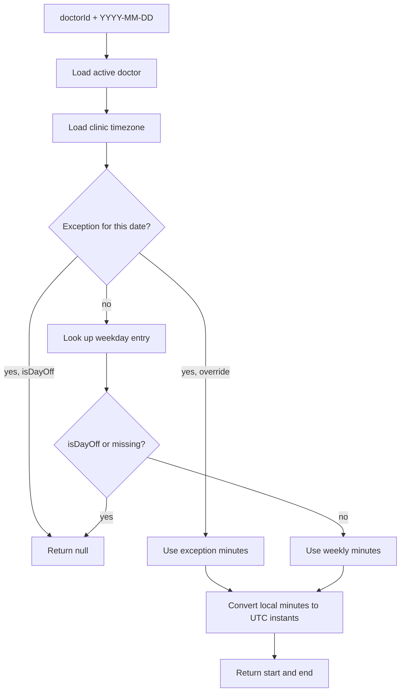

# Phase 3 — Working hours

## Goal

Every doctor has an editable weekly schedule plus per-date exceptions for holidays and half days. The phase ends by producing `resolveWorkingWindow(doctorId, date)` — the function that turns "Doctor A, 2026-09-15" into a concrete UTC interval. Phase 4 consumes that function and nothing else from here.

## Depends on

[Phase 2](./phase-2-clinic-and-doctors.md).

## Files to create

```
src/modules/doctors/
  schemas/schedule-exception.schema.ts
  working-hours.service.ts
  working-hours.controller.ts
  dto/working-hours-entry.dto.ts
  dto/update-working-hours.dto.ts
  dto/create-schedule-exception.dto.ts
  dto/schedule-exception-response.dto.ts
src/common/utils/
  time.util.ts
```

`WorkingHoursEntry` was already embedded on the user schema in phase 1; this phase gives it endpoints and meaning. `ScheduleException` is a new collection.

## Schemas

Both follow the tables in [architecture.md](../architecture.md#users). The two representation choices are worth restating because they prevent most timezone bugs in this area:

**Times are minutes from local midnight.** `540` is 09:00, `1080` is 18:00. All arithmetic is integer arithmetic; timezone only enters at the final conversion to an absolute instant.

**Exception dates are `YYYY-MM-DD` strings.** A holiday is a calendar label, not a moment. Storing it as a `Date` means it is really midnight in some zone, and the day it represents shifts depending on where you read it from. Validate the format with a regex plus a real calendar check, so `2026-02-30` is rejected.

The unique compound index on `{ doctorId: 1, date: 1 }` guarantees at most one exception per doctor per day, which keeps resolution unambiguous.

## Time utilities

`time.util.ts` holds the small set of conversions everything else builds on. Keep them here rather than inlining `luxon` calls across services — there should be exactly one place that knows how a local time becomes a UTC instant.

```ts
// '2026-09-15' + 540 + 'Asia/Yerevan' -> Date (UTC instant)
localDateAndMinutesToUtc(date: string, minutes: number, timezone: string): Date;

// Date -> weekday index in clinic-local time, 0 = Sunday
weekdayInZone(date: string, timezone: string): number;

// 540 -> '09:00', for human-readable messages
minutesToLabel(minutes: number): string;

// UTC instant -> '2026-09-15' in clinic-local time
utcToLocalDate(instant: Date, timezone: string): string;
```

Implement `localDateAndMinutesToUtc` with `DateTime.fromISO(date, { zone: timezone }).startOf('day').plus({ minutes }).toUTC().toJSDate()`. Do not compute an offset once and reuse it — offsets change across DST boundaries, and a window built by adding a stale offset lands an hour off twice a year.

## Endpoints

### `GET /doctors/:id/working-hours`

Any authenticated role. Returns the doctor's seven weekly entries plus any upcoming exceptions.

Always return all seven weekdays, filling absent ones with `isDayOff: true`. A client that has to reason about "missing means off" will get it wrong somewhere; an explicit array of seven is trivially renderable as a settings table.

Response shape:

```json
{
  "doctorId": "...",
  "timezone": "Asia/Yerevan",
  "weekly": [
    { "weekday": 0, "isDayOff": true, "startMinute": null, "endMinute": null, "startLabel": null, "endLabel": null },
    { "weekday": 1, "isDayOff": false, "startMinute": 540, "endMinute": 1080, "startLabel": "09:00", "endLabel": "18:00" }
  ]
}
```

Both the raw minutes and the formatted labels are returned. The minutes are what a form submits back; the labels are what gets displayed. Sending both saves every client from reimplementing the same formatting.

### `PUT /doctors/:id/working-hours`

Staff only. A full replacement, not a patch — the web client's settings screen edits the whole week at once, and replacement removes any question about how a partial update merges.

`UpdateWorkingHoursDto` wraps `weekly: WorkingHoursEntryDto[]` with `@ValidateNested({ each: true })` and `@Type(() => WorkingHoursEntryDto)`. Without the `@Type` decorator, nested validation silently does nothing and invalid entries sail through.

Per-entry validation: `weekday` is an integer in `0..6`; `startMinute` and `endMinute` are integers in `0..1440`. Service-level checks that decorators cannot express:

- Exactly seven entries, one per weekday, no duplicates.
- When `isDayOff` is `false`, both minute fields are present and `endMinute > startMinute`.
- When `isDayOff` is `true`, the minute fields are ignored and stored as `null`.

Reject a zero-length window explicitly. A window where start equals end produces no slots and looks identical to a bug.

### `GET /doctors/:id/schedule-exceptions`

Staff only. Query parameters `from` and `to` as `YYYY-MM-DD`, defaulting to today through 90 days ahead. Returns exceptions sorted by date.

### `POST /doctors/:id/schedule-exceptions`

Staff only. `CreateScheduleExceptionDto`: `date`, `isDayOff`, optional `startMinute`, `endMinute`, `reason`.

Upsert rather than insert. Setting the same date twice should update the existing exception, not return `409` and force the client into a delete-then-create dance for what the user experiences as one action.

Same window validation as the weekly hours. Reject dates in the past — an exception for a day that already happened cannot change anything and is almost certainly a typo.

### `DELETE /doctors/:id/schedule-exceptions/:exceptionId`

Staff only. Hard delete; an exception carries no history worth keeping. Returns `404` when the exception does not exist or belongs to a different doctor.

## The resolution function

This is the real deliverable of the phase. `WorkingHoursService.resolveWorkingWindow(doctorId, date)` returns `{ start: Date; end: Date } | null`, where `null` means the doctor does not work that date.



Precedence is: exception first, weekly hours second, closed by default. An exception with `isDayOff: false` and no minute overrides means "work the normal weekly hours that day" — useful for un-cancelling a day that was previously marked off.

Derive the weekday from the requested date **in clinic-local time**, not from a server-local `Date`. A request arriving at 23:00 UTC can be the next day in the clinic's zone, and getting this wrong produces a schedule that is silently off by one day for part of every day.

Export this function from `DoctorsModule`. It is the only thing phase 4 imports from here.

## Done when

- `GET /doctors/:id/working-hours` returns all seven weekdays with both minute values and formatted labels.
- `PUT /doctors/:id/working-hours` replaces the week for staff and returns `403` for a patient.
- Submitting six weekdays, a duplicate weekday, or `endMinute <= startMinute` each return `400` with a message identifying the offending entry.
- `POST /doctors/:id/schedule-exceptions` with `isDayOff: true` makes `resolveWorkingWindow` return `null` for that date.
- Posting the same date twice updates the existing exception rather than erroring.
- `resolveWorkingWindow` returns correct UTC instants for a date on each side of a DST transition in the clinic's timezone.
- A date where the doctor has no weekly entry resolves to `null` rather than throwing.
