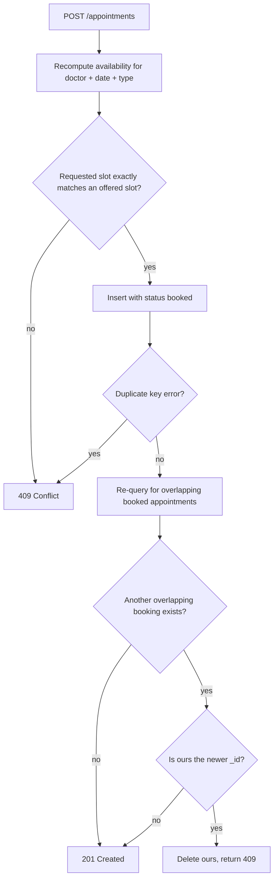

# Phase 5 — Appointments

## Goal

Bookings can be created and cancelled by both patients and staff, staff can see a day's queue, and patients can see their own appointments. No double-booking is possible even under concurrent requests.

## Depends on

[Phase 4](./phase-4-scheduling-engine.md).

## Files to create

```
src/modules/appointments/
  schemas/appointment.schema.ts
  appointments.module.ts
  appointments.controller.ts
  appointments.service.ts
  appointments-query.service.ts
  dto/create-appointment.dto.ts
  dto/day-queue-query.dto.ts
  dto/appointment-response.dto.ts
src/common/enums/
  appointment-type.enum.ts
  appointment-status.enum.ts
```

`AppointmentsQueryService` holds only read methods and is what `AvailabilityModule` imports. `AppointmentsModule` imports `AvailabilityModule` with `forwardRef` for the re-validation call. This is the cycle break described in [architecture.md](../architecture.md#module-map); resolve it now, because Nest's circular-dependency error at boot is opaque enough to lose an afternoon to.

## Schema and indexes

The `appointments` schema follows the table in [architecture.md](../architecture.md#appointments). The indexes are not incidental — one of them is a correctness mechanism, not an optimization:

```ts
AppointmentSchema.index(
  { doctorId: 1, startTime: 1 },
  { unique: true, partialFilterExpression: { status: 'booked' } },
);
AppointmentSchema.index({ doctorId: 1, startTime: 1, status: 1 });
AppointmentSchema.index({ patientId: 1, startTime: -1 });
```

The partial filter is what makes the unique index usable. Without it, cancelling an appointment would permanently block that start time from being rebooked, because the cancelled document would still occupy the unique key. Scoping uniqueness to `status: 'booked'` means a cancellation frees the slot instantly.

Ensure indexes are actually built. `autoIndex` is on by default in development but commonly disabled in production configs, and a missing unique index turns the guarantee below into a silent no-op. Either leave `autoIndex` enabled or call `syncIndexes()` at boot.

## Preventing double-booking

Two patients staring at the same slot on their phones will eventually tap Confirm at the same moment. The MVP does not use MongoDB transactions — that would require a replica set for every developer and every environment. Instead, correctness comes from three layers.



**Layer 1 — re-validate against the engine.** Recompute availability at commit time and require the requested `{ start, end, type }` to match an offered slot exactly. This catches the ordinary case where the client's slot list went stale, and it is also what enforces working hours and the minimum treatment duration. A client cannot invent a 20-minute treatment by posting arbitrary times.

**Layer 2 — the unique index.** Two simultaneous inserts for the same doctor and start time cannot both succeed; MongoDB rejects the second with error code `11000`. Catch it and return `409` with the patient-facing message. This is the layer that actually closes the race, because layer 1 can pass concurrently in two request handlers.

**Layer 3 — verify after insert.** The unique index only covers identical start times. Two different-length treatments starting at different times can still overlap: one at 11:00 for 75 minutes and one at 11:30 for 90 minutes have different keys but occupy the same minutes. After a successful insert, re-query for any other `booked` appointment for that doctor overlapping `[start, end)`. If one exists, the two requests raced past layer 1 together. Resolve deterministically by comparing `_id` — ObjectIds are monotonic enough for this — and have the later document delete itself and return `409`. The earlier one proceeds.

Layer 3 is a compensating action, not a transaction. There is a sub-millisecond window where both bookings exist. For a single clinic where the realistic collision rate is a handful of times per year and the compensation resolves in the same request, that is an acceptable trade for keeping the deployment story to "run a MongoDB container".

If the clinic later grows to a scale where this matters, the upgrade path is a replica set plus wrapping steps 1 through 3 in a session transaction. The layers stay exactly as they are; they just gain atomicity.

## Endpoints

### `POST /appointments`

Any authenticated role, but the body differs by caller.

`CreateAppointmentDto`: `doctorId`, `type`, `startTime` (ISO-8601 UTC), and optionally `notes`, `patientId`, `patientName`, `patientPhone`.

- **Patient caller.** `patientId` is ignored and taken from the JWT. A patient booking on someone else's behalf is not an MVP feature and accepting the field would be an authorization hole.
- **Staff caller.** Either `patientId` for an existing patient, or `patientName` plus `patientPhone` to create a lightweight patient record inline. The web spec requires adding a walk-in whose record does not exist yet, and forcing staff through a separate registration screen mid-booking is the wrong flow.

Note that `endTime` is **not** accepted from the client. It is derived from the matched slot. Letting a client send its own end time is how a 90-minute treatment gets recorded as 15 minutes.

For the inline patient case, match on phone number first and reuse the existing record if found, so the same walk-in booked twice does not create two patients. Create the user with `role: 'patient'`, no password, and an `active` flag; they can later register properly against the same phone number.

Set `createdBy` from the caller's role and `createdById` from the JWT subject. When staff book for a patient these differ, and the queue view showing who made a booking is genuinely useful to the clinic.

Returns `201` with the full appointment, or `409` with a message safe to display verbatim: *"This slot was just taken by someone else. Please pick another time."*

### `GET /appointments?doctorId=&date=`

Staff only. The day queue — the primary screen of the web app, and the one staff live in.

Both parameters required. Returns appointments for that doctor and date sorted by `startTime`, including cancelled ones by default so staff can see what happened to the day. Add an optional `status` filter for when they want only the live queue.

Each item embeds the patient's `name` and `phone`. The queue is unusable without them, and making the client fetch each patient separately turns one screen into N+1 requests.

Filter by overlap with the local day, not by `startTime` alone, using the same window logic as phase 4. The clinic's day boundary is in its own timezone, so convert `date` to UTC instants through `time.util.ts` rather than comparing date strings.

### `GET /appointments/mine`

Patient only. The patient's own bookings, split into upcoming and past:

```json
{
  "upcoming": [ ... ],
  "past": [ ... ]
}
```

Splitting server-side keeps the two clients from disagreeing about where "now" is. Upcoming is `startTime >= now` with `status: 'booked'`, sorted ascending — the next appointment first, which is what the screen leads with. Past is everything else, sorted descending.

Each item embeds the doctor's `name`. `patientId` is always taken from the JWT and never from a query parameter.

### `GET /appointments/:id`

Any authenticated role. Patients may only read their own; staff may read any. Returns `404` rather than `403` when a patient requests someone else's, so the endpoint does not confirm that an appointment id exists.

### `DELETE /appointments/:id`

Any authenticated role. A **soft cancel**: set `status: 'cancelled'`, do not delete the document. The partial unique index ignores non-booked rows, so the slot becomes immediately available again — which is exactly the "one click to cancel, slot immediately becomes available" behaviour the web spec asks for.

Rules:

- Patients may cancel only their own bookings; staff may cancel any.
- Cancelling an already-cancelled appointment is idempotent and returns `200`, not an error. Double-tapping Cancel on a slow mobile connection should not produce a failure.
- Cancelling an appointment that has already started returns `400` for patients. Staff may still cancel it, since they are the ones recording what really happened.

Return the updated appointment so the client can update its local state without refetching.

## Response DTO

`AppointmentResponseDto` returns `id`, `doctorId`, `doctor: { id, name }`, `patientId`, `patient: { id, name, phone }`, `type`, `startTime`, `endTime`, `durationMinutes`, `status`, `createdBy`, `notes`.

Omit the `patient` block from patient-facing responses; a patient does not need their own details echoed back, and the shape stays identical apart from that.

`durationMinutes` is included explicitly rather than left for clients to compute. The web queue view needs it to render block length, and the spec calls for clearly flagging odd-length gap slots so staff are not confused by a 75-minute treatment.

## Verification

Reproduce the concurrency case by hand. Fetch availability, then fire two `POST /appointments` for the identical slot in parallel:

```bash
curl -s -XPOST ... & curl -s -XPOST ... & wait
```

Exactly one must return `201` and the other `409`. Then query the day and confirm a single `booked` appointment exists at that time.

Repeat with two overlapping but non-identical starts — 11:00 for 75 minutes against 11:30 for 90 — to exercise layer 3 rather than the unique index.

## Done when

- A patient can book a consultation and a treatment, and both appear in `GET /appointments/mine` under `upcoming`.
- Staff can book for an existing patient by id and for a walk-in by name and phone, with the walk-in creating exactly one patient record.
- Two concurrent bookings of the same slot yield one `201` and one `409`, with one `booked` document in the database.
- Two concurrent overlapping bookings with different start times yield one `201` and one `409`.
- Posting a `startTime` that availability did not offer returns `409`.
- Cancelling frees the slot: it reappears in the next availability response.
- Cancelling twice returns `200` both times.
- A patient reading or cancelling another patient's appointment gets `404`.
- The day queue shows patient names and includes cancelled appointments.
